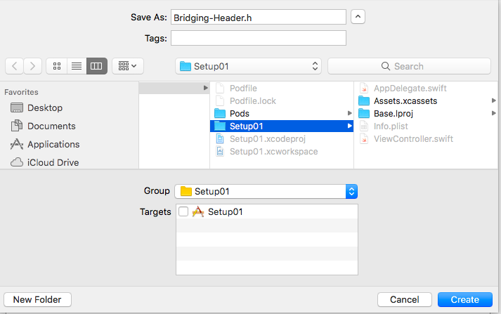

# iOS Swift CocoaPods Setup

[The documentation](https://github.com/particle-iot/particle-setup-ios) for setting up an iOS Particle Device Setup app using Swift and CocoaPods is pretty brief, so this expands on it a bit.

This tutorial was done using:

- particle-setup-ios 0.8.0 
- CocoaPods 1.4.0
- Xcode 9.2 
- Mac OS X High Sierra (10.13.3)

## Install CocoaPods

If you haven't already [installed CocoaPods](https://guides.cocoapods.org/using/getting-started.html), you need to do that first.

Typically:

```
sudo gem install cocoapods
```

## Create a new project

- Create a new iOS Swift Project, Single View. I named this one **Setup01**.


- Close the project in Xcode. You'll need to open a separate workspace generated by CocoaPods.

- Create a Podfile. It's located in the top level of the project, in the same directory as the .xcodeproject file. You'll probably want to do this from Terminal as you'll need to execute some commands.

```
source 'https://github.com/CocoaPods/Specs.git'

target 'Setup01' do
    pod 'ParticleSetup'
end
```

Replace **Setup01** with the name of your project.

- Make sure the CocoaPods repositories are up-to-date. This isn't needed every time. Also, if you just installed CocoaPods, it returns immediately without doing anything.

```
pod repo update
```

- Load the dependencies by doing a pod install in the directory where the Podfile is:

```
pod install
```

The install should look like this:

```
$ pod install
Analyzing dependencies
Downloading dependencies
Installing 1PasswordExtension (1.8.5)
Installing AFNetworking (3.2.0)
Installing Particle-SDK (0.7.0)
Installing ParticleSetup (0.8.0)
Generating Pods project
Integrating client project

[!] Please close any current Xcode sessions and use `Setup01.xcworkspace` for this project from now on.
Sending stats
Pod installation complete! There is 1 dependency from the Podfile and 4 total pods installed.

[!] Automatically assigning platform `ios` with version `11.2` on target `Setup01` because no platform was specified. Please specify a platform for this target in your Podfile. See `https://guides.cocoapods.org/syntax/podfile.html#platform`.
```

- Open the project again in Xcode using the newly created Setup01.xcworkspace file. Make sure you always use this file in the future, as well.

- Add Bridging-Header.h in the inner Setup01 directory.

```
#import "ParticleSetup.h"
#import "Particle-SDK.h"
```




- In Settings | Build Settings | Swift Compiler - General set Objective-C Bridging Header to Setup01/Bridging-Header.h


- In Settings | Build Settings | Search Paths set User Header Search Paths to search **Pods** recursively.


- Go to the Main.storyboard, drag a UIButton to your main ViewController. Double click it and type "Setup device", press the "Assistant editor" in XCode toolbar to show your ViewController code side by side to the storyboard. Ctrl-drag the button to your code to create a new IBAction, name the function "startDeviceSetup". 


- In the function body for startDeviceSetup add:

```
@IBAction func startDeviceSetup(_ sender: Any) {
    if let setupController = ParticleSetupMainController()
    {
        // setupController.delegate = self
        self.present(setupController, animated: true, completion: nil)
    }
}
```

If you've correctly set up your bridging header, above, you don't need to import anything explicitly in ViewController.swift.

- That's it! You should now be able to Build and Run and use the Setup Device button to bring up the device setup UI.


